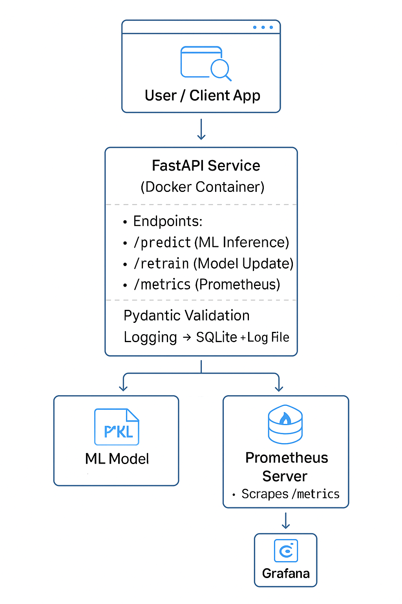

# MLOps (S2-24_AIMLCZG523) Assignment - 1 

Group No: 7
 
Group Member Names:
1. Mrs. VishnuPriya R | 2023ac05678@wilp.bits-pilani.ac.in 
2. Mr. Ravichander R |  2023ac05152@wilp.bits-pilani.ac.in 
3. Mr. Jithesh Nair |  2023ac05661@wilp.bits-pilani.ac.in 
4. Mrs. Priyanka Bhambure | 2023ac05792@wilp.bits-pilani.ac.in 
# 🏠 California Housing Price Prediction - MLOps API


---

## 📌 Overview
This project implements an **MLOps pipeline** for predicting California housing prices using a trained machine learning model.  
It features:
- Model serving via **FastAPI**
- On-demand **model retraining**
- **Logging** to SQLite and log files
- **Monitoring** with Prometheus & Grafana
- **Containerized deployment** via Docker

 
---

## 🏗 Architecture



**Flow:**
1. **Client** (Browser, curl, Postman) sends requests.
2. **FastAPI Service** handles:
   - `/predict` → Model inference
   - `/retrain` → Retrain model
   - `/metrics` → Prometheus metrics
3. **Pydantic Validation** ensures input schema correctness.
4. Logs stored in **SQLite** & log files.
5. Metrics exported to **Prometheus**.
6. **Grafana Dashboard** visualizes metrics.
7. **ML model** (`best_model.pkl`) serves predictions.

---

## 🚀 Features
- **Endpoints**:
  - `POST /predict`: Predict housing prices from features.
  - `POST /retrain`: Retrain the ML model.
  - `GET /metrics`: Prometheus-compatible metrics.
- **Logging**:
  - SQLite DB (`predictions.db`)
  - Application `.log` file
- **Monitoring**:
  - Prometheus metrics collection
  - Grafana dashboard visualization
- **Deployment**:
  - Docker container for portability

---

## 📂 Project Structure
```
.
├── .dvc/                  
├── .github/workflows/     # GitHub Actions CI/CD
│   └── main.yml
├── api/
│   └── app.py              # FastAPI app
├── data/                   
├── mlruns/                 
├── models/
│   └── best_model.pkl      
├── src/
│   ├── data_prep.py        
│   └── train.py            
├── tests/
│   └── test_sample.py      
├── predictions.db          
├── prometheus.yml          
├── Dockerfile              
├── requirements.txt        
└── README.md               
```

---

## ⚙️ Installation & Running

### 1️⃣ Clone the repository
```bash
git clone https://github.com/Jitheshn/mlops-pipeline-housing.git
cd mlops-pipeline-housing
```

### 2️⃣ Install dependencies
```bash
pip install -r requirements.txt
```

### 3️⃣ Run locally
```bash
uvicorn api.app:app --reload --host 0.0.0.0 --port 8000
```

### 4️⃣ Build & Run with Docker

#### Option 1 — Use the pre-trained model (no new dataset)
```bash
docker pull jitheshnairp/housing-api:latest
docker run -d --name my_housing_api -p 8000:8000 jitheshnairp/housing-api:latest
```

#### Option 2 — Use new dataset (You may wan to invoke /retrain end point)
```bash
docker pull jitheshnairp/housing-api:latest
docker run -d -v <path to housing.csv>:/app/data/raw/housing.csv --name my_housing_api -p 8000:8000 jitheshnairp/housing-api:latest
```

---

## 📊 Monitoring with Prometheus & Grafana

- **Prometheus Scrape Endpoint**:
```
http://localhost:8000/metrics
```
- **Prometheus UI**:
```
http://localhost:9090
```
- **Grafana UI**:
```
http://localhost:3000
```

---

## 🛠 Tech Stack
- **Language**: Python 3.9+
- **Framework**: FastAPI
- **Model**: Scikit-learn
- **Data Versioning**: DVC
- **Monitoring**: Prometheus + Grafana
- **Containerization**: Docker
- **Validation**: Pydantic

---

## 📜 License
This project is licensed under the MIT License.
